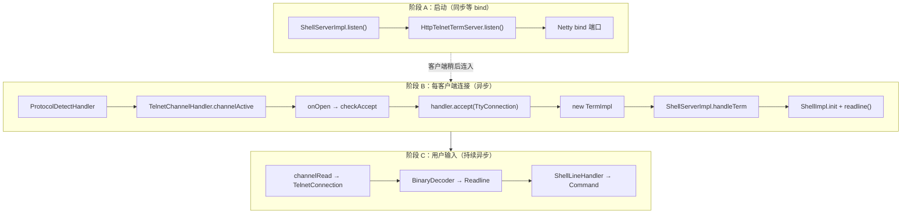

# Arthas 与 termd 建立连接的关键代码与调用链

> 归档自问答：Arthas 和 termd 建立连接的关键代码是否是 `HttpTelnetTermServer.listen()` 与 `TelnetTtyConnection.checkAccept()`；Netty 异步收数据后如何交给 `ShellServerImpl` 做后续处理。
>
> 归档日期：2026-06-17

关联文档：[telnet-negotiation-and-accept.md](./telnet-negotiation-and-accept.md)、[command-flow-and-termd.md](./command-flow-and-termd.md)、[readline-interaction-handle.md](./readline-interaction-handle.md)

关联项目：`D:\mycode\termd`、`D:\mycode\arthas`

---

## 问题：连接打通的关键代码在哪里？

用户标出的两段代码：

**Arthas 部分**（`HttpTelnetTermServer.listen()`）：

```java
@Override
public TermServer listen(Handler<Future<TermServer>> listenHandler) {
    // TODO: charset and inputrc from options
    bootstrap = new NettyHttpTelnetTtyBootstrap(workerGroup, httpSessionManager).setHost(hostIp).setPort(port);
    try {
        bootstrap.start(new Consumer<TtyConnection>() {
            @Override
            public void accept(final TtyConnection conn) {
                termHandler.handle(new TermImpl(Helper.loadKeymap(), conn));
            }
        }).get(connectionTimeout, TimeUnit.MILLISECONDS);
        listenHandler.handle(Future.<TermServer>succeededFuture());
    } catch (Throwable t) {
        logger.error("Error listening to port " + port, t);
        listenHandler.handle(Future.<TermServer>failedFuture(t));
    }
    return this;
}
```

**termd 部分**（`TelnetTtyConnection.checkAccept()`）：

```java
private void checkAccept() {
    if (!accepted) {
        if (!outBinary | (outBinary && sendingBinary)) {
            if (!inBinary | (inBinary && receivingBinary)) {
                accepted = true;
                readBuffer.setReadHandler(eventDecoder);
                handler.accept(this);
            }
        }
    }
}
```

**判断基本正确，但要分清两件事：**

1. **`listen()` 里的 `bootstrap.start(...).get()`**：只等 **端口绑定成功**（服务器起来），不等客户端连上来。
2. **`checkAccept()` → `handler.accept(this)`**：才是 **每个客户端连接** 交给 Arthas 的「打通点」。

---

## 一、你标的两段代码：各自干什么

### Arthas 侧：注册「连接就绪后做什么」

```java
bootstrap.start(new Consumer<TtyConnection>() {
    @Override
    public void accept(final TtyConnection conn) {
        termHandler.handle(new TermImpl(Helper.loadKeymap(), conn));
    }
});
```

这里的 `Consumer` **不会立刻执行**，而是传给 termd，存进 `TelnetTtyConnection` 构造参数里，等 `checkAccept()` 时再调。

`NettyHttpTelnetTtyBootstrap.start` 嵌套保存：

```java
public void start(final Consumer<TtyConnection> factory, Consumer<Throwable> doneHandler) {
    httpTelnetTtyBootstrap.start(new Supplier<TelnetHandler>() {
        @Override
        public TelnetHandler get() {
            return new TelnetTtyConnection(inBinary, outBinary, charset, factory);
        }
    }, factory, doneHandler);
}
```

每个新 TCP 连接会 `handlerFactory.get()` 得到一个 **新的** `TelnetTtyConnection`，但里面的 `factory` 是 **同一个** Arthas 回调。

`termHandler` 在更早一步挂上的：

```java
// ShellServerImpl.listen()
for (TermServer termServer : toStart) {
    termServer.termHandler(new TermServerTermHandler(this));
    termServer.listen(handler);
}
```

即：`termHandler` = `TermServerTermHandler` → `shellServer.handleTerm(term)`。

### termd 侧：真正「交给 Arthas」的瞬间

```java
handler.accept(this);  // this = TelnetTtyConnection，实现了 TtyConnection
```

这里的 `handler` 就是上面那个 `Consumer<TtyConnection>`，默认 `inBinary/outBinary=false` 时在 **`onOpen()` 里同步调用**，不等客户端回复。详见 [telnet-negotiation-and-accept.md](./telnet-negotiation-and-accept.md)。

---

## 二、完整调用链（从启动到 Shell）

分三阶段看最清楚。

### 阶段 A：进程启动，只绑端口（同步等 bind）

```text
ArthasBootstrap
  → ShellServerImpl.listen()
       termServer.termHandler(TermServerTermHandler)
       HttpTelnetTermServer.listen()
         NettyHttpTelnetTtyBootstrap.start(factory, doneHandler)
           NettyHttpTelnetBootstrap: ServerBootstrap.bind(host, port)
         .get(connectionTimeout)   ← 只等到 bind 成功/失败
```

`factory` 在这一步被 **嵌套保存**，尚未执行。

---

### 阶段 B：客户端连上来（全异步，Netty EventLoop）

```text
TCP accept
  → ProtocolDetectHandler.channelRead / channelActive
       前 3 字节不是 "GET" → Telnet 路径
       pipeline.addLast(TelnetChannelHandler)
  → TelnetChannelHandler.channelActive
       new NettyTelnetConnection(TelnetTtyConnection, ctx)
       conn.onInit()
  → TelnetConnection.onInit()
       handler.onOpen(conn)    // TelnetTtyConnection.onOpen
         发 IAC WILL ECHO / SGA / DO NAWS / DO TERMINAL_TYPE
         checkAccept()         ← 默认立刻通过
           handler.accept(this)   ← 【termd → arthas 边界】
```

**ProtocolDetectHandler**（`arthas/.../httptelnet/ProtocolDetectHandler.java`）同端口支持 HTTP/WebSocket：前 3 字节是 `GET` 走 WebSocket，否则走 Telnet。

Arthas 侧接到后：

```text
Consumer.accept(TtyConnection conn)
  → termHandler.handle(new TermImpl(keymap, conn))
  → TermServerTermHandler.handle(term)
  → ShellServerImpl.handleTerm(term)
       createShell(term) → ShellImpl
       session.init()      // 写 welcome、挂 interrupt/close handler
       sessions.put(...)
       session.readline()    // 进入 Readline 等用户输入
```

**`ShellServerImpl.handleTerm` 源码**：

```java
public void handleTerm(Term term) {
    synchronized (this) {
        if (closed) {
            term.close();
            return;
        }
    }

    ShellImpl session = createShell(term);
    tryUpdateWelcomeMessage();
    session.setWelcome(welcomeMessage);
    session.closedFuture.setHandler(new SessionClosedHandler(this, session));
    session.init();
    sessions.put(session.id, session);
    session.readline(); // Now readline
}
```

**到这里才算「一个会话打通」**：有 `TermImpl`、有 `ShellImpl`、在等 `$` 提示符输入。

---

### 阶段 C：用户敲键（又一次异步管道）

```text
Netty channelRead (EventLoop 线程)
  → TelnetConnection.receive(byte[])     // IAC 协商 / 用户数据分流
  → TelnetTtyConnection.onData(byte[])
  → BinaryDecoder (TelnetCharset)
  → ReadBuffer → TtyEventDecoder
  → stdinHandler (Readline 替换后的)
  → EventQueue → Interaction.handle()
  → end("dashboard") 时
  → RequestHandler → ShellLineHandler → Job → Command
```

和阶段 B 不同：阶段 B 是 **一次性的连接回调**；阶段 C 是 **持续的 Netty 读事件 + readline 事件循环**。`handleTerm` 在连接时调一次；**后续按键**走 `channelRead` → Readline → `ShellLineHandler`，不再经过 `handleTerm`。

**`ShellImpl.readline()`**：

```java
public void readline() {
    term.readline(prompt, new ShellLineHandler(this),
            new CommandManagerCompletionHandler(commandManager));
}
```

---

## 三、一张总图



---

## 四、为什么感觉「嵌套深 + 全是异步」

本质是 **回调套回调**，角色可以记成 4 层：

| 层 | 谁 | 干什么 |
|----|-----|--------|
| Netty | `ChannelHandler` | IO 事件：`channelActive` / `channelRead` |
| termd Telnet | `TelnetConnection` 状态机 | 剥 IAC、协商选项 |
| termd TTY | `TelnetTtyConnection` | `byte[]`→`int[]`、`checkAccept`、桥接 `TtyConnection` |
| Arthas | `TermImpl` → `ShellImpl` | Shell 语义、命令执行 |

异步点主要有：

1. **Netty EventLoop**：每个 `channelRead` 在 IO 线程里跑，不阻塞业务线程。
2. **`checkAccept` 在 `onOpen` 里同步调**，但 `onOpen` 本身在 `channelActive` 里触发，仍是 EventLoop 线程。
3. **Readline `deliver()`** 可能 `conn.execute(Runnable)` 投递到同连接的执行器。
4. **命令执行** Job 又有自己的线程/调度。

所以不是一条同步调用栈，而是 **「事件进来 → 一层层 Consumer/Handler 往里传」**。

---

## 五、和 WebSocket 路径的对比（HttpTelnet 特有）

`HttpTelnetTermServer` 同端口还支持 HTTP/WebSocket：

- **Telnet**：`ProtocolDetectHandler` → `TelnetChannelHandler` → `checkAccept` → 同一个 `factory`。
- **WebSocket**：前 3 字节是 `GET` → `TtyWebSocketFrameHandler` → 直接 `ttyConnectionFactory.accept(conn)`，**绕过 Telnet 协商**，但 Arthas 侧仍是 `termHandler.handle(new TermImpl(...))`。

打通 Arthas 的回调是同一个 `Consumer<TtyConnection>`，只是 termd 里 **建 `TtyConnection` 的方式不同**。

---

## 六、对照表

| 说法 | 更准确的说法 |
|------|--------------|
| `checkAccept` + `handler.accept` = 连接打通 | ✅ 对，这是 **每个客户端会话** 交给 Arthas 的边界 |
| `listen()` 里那段是 Arthas 关键代码 | ✅ 对，但是 **注册回调 + 绑端口**；`.get()` 不等客户端 |
| 之后 Netty 异步收数据给 ShellServerImpl | ✅ 对；`handleTerm` 在连接时调一次；**后续按键**走 `channelRead` → Readline → `ShellLineHandler`，不再经过 `handleTerm` |

**记忆口诀**：

- `listen()` = 开店（绑端口 + 写好「客人来了怎么办」）。
- `checkAccept()` = 客人进门（`TermImpl` + `ShellImpl` + `readline()`）。
- `channelRead()` = 客人说话（每次按键一条异步链）。

---

## 七、相关源码索引

| 环节 | 文件 |
|------|------|
| Arthas 绑端口 + 注册 factory | `arthas/.../httptelnet/HttpTelnetTermServer.java` |
| factory 嵌套进 TelnetTtyConnection | `arthas/.../httptelnet/NettyHttpTelnetTtyBootstrap.java` |
| 协议探测 Telnet/HTTP | `arthas/.../httptelnet/ProtocolDetectHandler.java` |
| Netty 连接入口 | `termd/.../netty/TelnetChannelHandler.java` |
| checkAccept 边界 | `termd/.../telnet/TelnetTtyConnection.java` |
| termHandler 桥接 | `arthas/.../handlers/server/TermServerTermHandler.java` |
| Shell 创建 | `arthas/.../impl/ShellServerImpl.java`（`handleTerm`） |
| 进入 readline | `arthas/.../impl/ShellImpl.java`（`init`、`readline`） |
| Telnet 纯端口版（逻辑相同） | `arthas/.../TelnetTermServer.java` |
