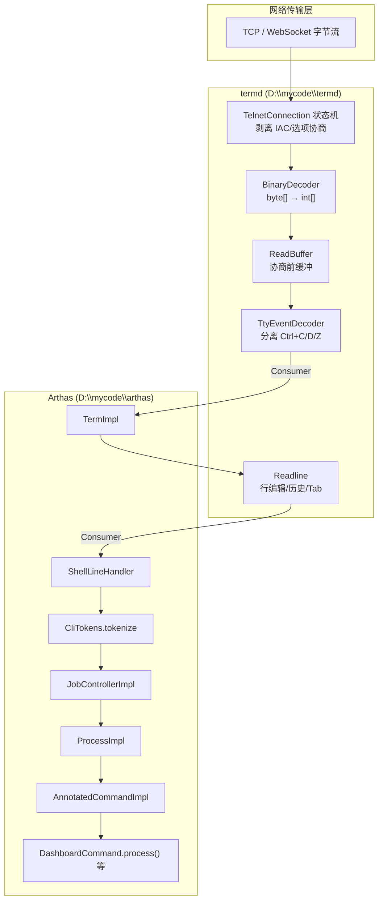

# Arthas 命令执行全链路与 termd 数据流转

> 本文梳理从命令行输入到后端命令执行的完整路径，以及 termd 网络交互层的数据转换机制。
>
> 关联项目：
> - **Arthas**：`D:\mycode\arthas`
> - **termd**（Arthas 终端底层库）：`D:\mycode\termd`

---

## 一、整体架构（两层叠加）



**核心结论：**

- **termd 在 TTY 语义层统一用 `Consumer<int[]>` 传递 Unicode 码点批次**，不是字节数组。
- **Arthas 在 termd 之上再包一层**，把 `int[]` 交给 Readline，最终变成 `String line`，再分词、查命令、执行。

Arthas 并不自己处理 Telnet 协议，**终端 I/O 全在 termd**；Arthas 只负责 Shell 语义（分词、Job、命令路由、结果渲染）。

---

## 二、`Consumer<int[]>` 到底是什么？为什么到处都是？

这是 termd 的**核心数据契约**，不是 Java 8 的 `java.util.function.Consumer`，而是 termd 自研的：

```java
// io.termd.core.function.Consumer
void accept(T t);
```

### 2.1 `int[]` 的含义

每个 `int` 是一个 **Unicode 码点（code point）**，不是 byte，也不是 char：

| 类型 | 含义 | 问题 |
|------|------|------|
| `byte[]` | 原始网络字节 | 需 charset 解码，Telnet 还有 IAC 控制字节 |
| `char[]` | UTF-16 单元 | 代理对（emoji 等）处理麻烦 |
| **`int[]`** | **完整 Unicode 码点** | TTY 层统一语义，上层不关心编码 |

工具类 `io.termd.core.util.Helper`：

- `toCodePoints(String)` → `int[]`
- `fromCodePoints(int[])` → `String`

### 2.2 为什么用 Consumer 而不是直接返回值？

termd 是**事件驱动、管道式**设计：每一层实现 `Consumer<int[]>`，把解码结果 `accept()` 给下一层，形成单向数据流。你在代码里看到的「乱」，本质是**同一类型在不同层反复出现**：

```
BinaryDecoder.onChar          : Consumer<int[]>  ← 解码完回调
ReadBuffer                    : Consumer<int[]>  ← 入队缓冲
TtyEventDecoder               : Consumer<int[]>  ← 拦截 Ctrl+C 等
TtyConnection.setStdinHandler : Consumer<int[]>  ← 应用层入口
DefaultTermStdinHandler       : Consumer<int[]>  ← Arthas 包装
Readline.Interaction          : Consumer<int[]>  ← 行编辑入口
```

---

## 三、termd 入站数据流（逐字节到码点）

以 Telnet 为例，完整链路：

### 第 1 层：Netty 收字节

```
TelnetChannelHandler.channelRead()
  → ByteBuf 转 byte[]
  → NettyTelnetConnection.receive(data)
  → TelnetConnection.receive(data)   // 状态机
```

### 第 2 层：Telnet 协议状态机

`TelnetConnection.receive()` 逐字节驱动状态机：

| 状态 | 作用 |
|------|------|
| `DATA` | 普通数据；遇 `0xFF (IAC)` 进入协议解析 |
| `IAC/DO/DONT/WILL/WONT` | 选项协商（ECHO、SGA、BINARY、NAWS 等） |
| `SB` | 子协商（窗口大小、终端类型） |

**只有纯用户数据**才会进入 `onData(byte[])`，IAC 序列被剥离。

### 第 3 层：TelnetTtyConnection 建管道

`TelnetTtyConnection` 构造时把各层串起来：

```java
// io.termd.core.telnet.TelnetTtyConnection
public TelnetTtyConnection(boolean inBinary, boolean outBinary, Charset charset, Consumer<TtyConnection> handler) {
    this.decoder = new BinaryDecoder(512, TelnetCharset.INSTANCE, readBuffer);
    this.encoder = new BinaryEncoder(charset, new Consumer<byte[]>() {
        @Override
        public void accept(byte[] data) {
            conn.write(data);
        }
    });
    this.stdout = new TtyOutputMode(encoder);
}
```

管道关系：

```
onData(byte[])
  → BinaryDecoder.write(byte[])
      → CharsetDecoder 解码
      → 代理对合并为 code point
      → onChar.accept(int[])   // 回调 ReadBuffer
  → ReadBuffer.accept(int[])  // 入队，协商完成后 drain
  → TtyEventDecoder.accept(int[])  // 分离 Ctrl+C(3)/Ctrl+Z(26)/Ctrl+D(4)
  → stdinHandler.accept(int[])     // 应用层
```

`BinaryDecoder` 核心解码逻辑：

```java
// io.termd.core.io.BinaryDecoder
while (true) {
    IntBuffer iBuf = IntBuffer.allocate(bBuf.remaining());
    CoderResult result = decoder.decode(bBuf, cBuf, false);
    cBuf.flip();
    while (cBuf.hasRemaining()) {
        char c = cBuf.get();
        // ... 代理对处理 ...
        iBuf.put((int) c);
    }
    onChar.accept(codePoints);
}
```

### 第 4 层：ReadBuffer — 协商前缓冲

Telnet 连接建立时要协商 ECHO/BINARY/NAWS 等，**协商完成前**上层 handler 还没就绪。`ReadBuffer` 先把 `int[]` 入队：

```java
// io.termd.core.tty.ReadBuffer
public void accept(int[] data) {
    queue.add(data);
    while (readHandler != null && queue.size() > 0) {
        data = queue.poll();
        if (data != null) {
            readHandler.accept(data);
        }
    }
}
```

协商完成后 `checkAccept()` 才把 `eventDecoder` 设为 readHandler：

```java
// io.termd.core.telnet.TelnetTtyConnection
private void checkAccept() {
    if (!accepted) {
        if (!outBinary | (outBinary && sendingBinary)) {
            if (!inBinary | (inBinary && receivingBinary)) {
                accepted = true;
                readBuffer.setReadHandler(eventDecoder);
                handler.accept(this);  // 通知 Arthas：连接可用
            }
        }
    }
}
```

### 第 5 层：TtyEventDecoder — 控制字符分流

扫描码点流，遇到特殊键就**截断并分发**：

```java
// io.termd.core.tty.TtyEventDecoder
public void accept(int[] data) {
    // val == 3  → TtyEvent.INTR  (Ctrl+C)
    // val == 26 → TtyEvent.SUSP  (Ctrl+Z)
    // val == 4  → TtyEvent.EOF   (Ctrl+D)
    // 普通字符 → readHandler.accept(data)
}
```

`TtyConnection.setStdinHandler(handler)` 实际是：

```java
// io.termd.core.telnet.TelnetTtyConnection
public void setStdinHandler(Consumer<int[]> handler) {
    eventDecoder.setReadHandler(handler);
}
```

所以 stdinHandler **永远在 eventDecoder 之后**。

---

## 四、Arthas 接入 termd（TermImpl 桥接层）

### 4.1 连接建立

```
HttpTelnetTermServer.listen()
  → NettyHttpTelnetBootstrap
  → ProtocolDetectHandler（前 3 字节 "GET" → HTTP，否则 Telnet）
  → TelnetChannelHandler → TelnetTtyConnection
  → new TermImpl(keymap, conn)
  → ShellServerImpl.handleTerm() → ShellImpl.init() → readline()
```

### 4.2 TermImpl 注册 handler

```java
// com.taobao.arthas.core.shell.term.impl.TermImpl
echoHandler = new DefaultTermStdinHandler(this);
conn.setStdinHandler(echoHandler);
conn.setEventHandler(new EventHandler(this));
```

`DefaultTermStdinHandler` 做两件事：

```java
// com.taobao.arthas.core.shell.handlers.term.DefaultTermStdinHandler
public void accept(int[] codePoints) {
    term.echo(codePoints);                        // 回显到终端
    term.getReadline().queueEvent(codePoints);    // 送入 readline 事件队列
}
```

> **注意**：这是默认/空闲态的 stdin 处理器。**日常在提示符下输入命令时，Readline 会替换 stdinHandler，字符显示由 Readline 的 `refresh()` 负责，而非此处的 `term.echo()`。** 详见 [term-echo-and-readline.md](./term-echo-and-readline.md)。

### 4.3 Readline 接管 stdinHandler

`ShellImpl.readline()` 调用 `term.readline(prompt, ShellLineHandler, ...)`，Readline 的 `Interaction.install()` 会**替换** stdinHandler：

```java
// io.termd.core.readline.Readline.Interaction
private void install() {
    prevReadHandler = conn.getStdinHandler();
    conn.setStdinHandler(new Consumer<int[]>() {
        @Override
        public void accept(int[] data) {
            synchronized (Readline.this) {
                decoder.append(data);  // EventQueue 累积
            }
            deliver();               // 匹配 Keymap → KeyEvent
        }
    });
    conn.setEventHandler(null);  // readline 期间自己处理 Ctrl+C
}
```

Readline 内部流程：

```
int[] codePoints
  → EventQueue.append()     // 累积待匹配
  → EventQueue.match()      // 对照 Keymap（Enter/Backspace/方向键等）
  → KeyEvent
  → LineBuffer 更新         // 行编辑、ANSI 光标移动
  → 用户按 Enter
  → buffer.toString() 得到完整行
  → requestHandler.accept(String line)   // 类型从 int[] 变为 String！
```

Arthas 的 `RequestHandler` 接住这行字符串：

```java
// com.taobao.arthas.core.shell.handlers.term.RequestHandler
public void accept(String line) {
    term.setInReadline(false);
    lineHandler.handle(line);  // → ShellLineHandler.handle(line)
}
```

**到这里，数据形态完成了关键转换：`byte[] → int[] → String`**。

---

## 五、Arthas 命令处理（String → 后端 Handler）

### 第 1 步：ShellLineHandler — 行级预处理

```java
// com.taobao.arthas.core.shell.handlers.shell.ShellLineHandler
public void handle(String line) {
    List<CliToken> tokens = CliTokens.tokenize(line);
    CliToken first = TokenUtils.findFirstTextToken(tokens);
    String name = first.value();

    // Shell 内置命令直接处理，不进 Job 系统
    if (name.equals("exit") || ...) { handleExit(); return; }
    if (name.equals("jobs")) { handleJobs(); return; }
    // fg / bg / kill ...

    Job job = createJob(tokens);  // → shell.createJob(tokens)
    if (job != null) { job.run(); }
}
```

### 第 2 步：CliTokens.tokenize — Shell 级分词（第一层解析）

`CliTokenImpl.tokenize()` 规则：

1. 空白（空格/Tab）→ `blank` token
2. 引号（单/双引号、转义）→ 用 termd 的 `LineStatus` 解析
3. `correctPipeChar()` 修正管道符：  
   `thread | grep xxx` → `[thread, |, grep, xxx]`

输出 `List<CliToken>`，每个 token 有 `raw()`（原始）和 `value()`（解析后值）。

### 第 3 步：JobControllerImpl.createJob — 命令查找 + 管道解析

```java
// com.taobao.arthas.core.shell.system.impl.JobControllerImpl
private Process createProcess(...) {
    while (tokens.hasNext()) {
        CliToken token = tokens.next();
        if (token.isText()) {
            Command command = commandManager.getCommand(token.value());
            if (command != null) {
                return createCommandProcess(command, tokens, ...);
            } else {
                throw new IllegalArgumentException(token.value() + ": command not found");
            }
        }
    }
}
```

`InternalCommandManager.getCommand("dashboard")` 从 `BuiltinCommandPack` 查找，返回 `AnnotatedCommandImpl(DashboardCommand.class)`。

`createCommandProcess()` 同时解析：

| 语法 | 处理 |
|------|------|
| `\|` 管道 | 后续 token 注入 `stdoutHandlerChain`（grep/wc/tee/plaintext） |
| `>` / `>>` 重定向 | `RedirectHandler` |
| 末尾 `&` | 后台 Job |
| 默认 | `TermHandler(term)` 输出到终端 |

### 第 4 步：ProcessImpl.run — 命令参数解析（第二层解析）

```java
// com.taobao.arthas.core.shell.system.impl.ProcessImpl
final List<String> args2 = new LinkedList<String>();
for (CliToken arg : args) {
    if (arg.isText()) { args2.add(arg.value()); }
}
// middleware-cli 解析 @Option 注解参数
cl = commandContext.cli().parse(args2);
process.setCommandLine(cl);

Runnable task = new CommandProcessTask(process);
ArthasBootstrap.getInstance().execute(task);  // 线程池异步执行
```

**双层解析：**

| 层 | 工具 | 职责 |
|----|------|------|
| Shell 级 | `CliTokens` | 分词、管道 `\|`、重定向 `>` |
| 命令级 | `middleware.cli.CommandLine` | 解析 `-n 1` 等 `@Option` 参数 |

### 第 5 步：AnnotatedCommandImpl — 反射调用具体命令

```java
// com.taobao.arthas.core.shell.command.impl.AnnotatedCommandImpl
private void process(CommandProcess process) {
    AnnotatedCommand instance = clazz.newInstance();
    CLIConfigurator.inject(process.commandLine(), instance);  // 注入参数到字段
    instance.process(process);  // 调用 DashboardCommand.process(process) 等
}
```

命令注册在 `BuiltinCommandPack` 构造函数中，每个 `XXXCommand.class` 通过 `Command.create()` 包装为 `AnnotatedCommandImpl`。

---

## 六、出站数据流（命令结果 → 终端）

反向路径，对称设计：

```
DashboardCommand.process()
  → process.appendResult(DashboardModel)
  → TermResultDistributorImpl
  → ResultView.draw() → String
  → term.write(String)
  → Helper.toCodePoints(String) → int[]
  → TtyOutputMode: \n → \r\n
  → BinaryEncoder: int[] → byte[] (UTF-8)
  → TelnetConnection.write(byte[])
  → Netty writeAndFlush
```

`TtyConnection.write(String)` 源码：

```java
// io.termd.core.telnet.TelnetTtyConnection
public TtyConnection write(String s) {
    int[] codePoints = Helper.toCodePoints(s);
    stdoutHandler().accept(codePoints);
    return this;
}
```

---

## 七、完整时序（用户输入 `dashboard -n 1` 并回车）

```
[客户端] 键盘 "dashboard -n 1\r"
    ↓ TCP 字节流
[termd] TelnetConnection 状态机 → 剥离 IAC → onData(byte[])
[termd] BinaryDecoder → TelnetCharset/UTF-8 → int[]{100,97,115,104,...}
[termd] ReadBuffer → TtyEventDecoder → (无 Ctrl 信号)
[termd] Readline 替换后的 stdinHandler.accept(int[])   ← 非 DefaultTermStdinHandler
         → EventQueue → KeyEvent → LineBuffer.refresh() → 屏幕显示字符
[termd] Readline: 累积字符到 LineBuffer
[termd] 用户按 Enter(13) → buffer="dashboard -n 1"
[termd] requestHandler.accept("dashboard -n 1")  ← String 出现
[Arthas] RequestHandler → ShellLineHandler.handle("dashboard -n 1")
[Arthas] CliTokens.tokenize → [dashboard, -n, 1]
[Arthas] InternalCommandManager.getCommand("dashboard") → DashboardCommand
[Arthas] JobControllerImpl.createCommandProcess()
         remaining = [-n, 1]
         stdoutHandlerChain = [TermHandler]
[Arthas] ProcessImpl.run()
         args2 = ["-n", "1"]
         cli.parse(["-n","1"]) → CommandLine(n=1)
         executorService.execute(CommandProcessTask)
[Arthas] AnnotatedCommandImpl.process()
         inject(n=1) → DashboardCommand.process(process)
         appendResult(...) → term.write(...) → 用户看到输出
[Arthas] process.end() → ShellImpl.readline() → 等待下一条命令
```

---

## 八、其他入口（旁路，最终汇聚同一路径）

| 入口 | 输入形态 | 跳过的层 | 汇聚点 |
|------|----------|----------|--------|
| **Telnet CLI** | TCP 字节 → termd 全链路 | 无 | `ShellLineHandler.handle(String)` |
| **Web Console** | WebSocket TextFrame → `ExtHttpTtyConnection` | Telnet 状态机 | 同上（termd HTTP TTY） |
| **HTTP REST API** | `POST /api` JSON `{"command":"thread"}` | termd/Readline 全跳过 | `CliTokens.tokenize(line)` → `JobControllerImpl.createJob()` |
| **MCP** | 程序化调用 | 无真实 TTY | `CommandExecutorImpl` → 同上 |

HTTP API 示例路径：

```
HttpRequestHandler → HttpApiHandler.handle()
  → JSON → ApiRequest
  → CliTokens.tokenize(commandLine)
  → jobController.createJob(..., ApiTerm, PackingResultDistributor)
  → ProcessImpl.run() → 同上
```

---

## 九、理解 `Consumer<int[]>` 的「乱」——一张对照表

| 类 | 实现的接口 | 输入 | 输出给谁 |
|----|-----------|------|----------|
| `BinaryDecoder` | 持有 `Consumer<int[]> onChar` | `byte[]` | `ReadBuffer.accept(int[])` |
| `ReadBuffer` | `Consumer<int[]>` | `int[]` | `TtyEventDecoder.accept(int[])` |
| `TtyEventDecoder` | `Consumer<int[]>` | `int[]` | `stdinHandler.accept(int[])` 或 `eventHandler` |
| `DefaultTermStdinHandler` | `Consumer<int[]>` | `int[]` | echo + readline.queueEvent |
| `Readline.Interaction` | 匿名 `Consumer<int[]>` | `int[]` | EventQueue → KeyEvent |
| `BinaryEncoder` | `Consumer<int[]>` | `int[]` | `Consumer<byte[]>` → Telnet write |
| `TtyOutputMode` | 包装 `Consumer<int[]>` | `int[]` | `\n`→`\r\n` 后交给 encoder |

**规律**：termd 在 TTY 边界以内全部用 `int[]`（码点）；只有 Readline 完成一行编辑后才变成 `String`；Arthas 从 `String` 开始才是自己的 Shell 语义。

---

## 十、Agent 启动与服务绑定（补充）

```
arthas-boot Bootstrap
  → Arthas.attachAgent() → VirtualMachine.loadAgent()
  → AgentBootstrap.premain/agentmain
  → ArthasBootstrap.getInstance().bind()
  → ShellServerImpl + HttpTelnetTermServer / HttpTermServer
  → shellServer.listen()
  → 注册 BuiltinCommandPack（所有诊断命令）
```

默认端口：Telnet **3658**，HTTP **8563**。

---

## 十一、关键文件索引

### termd (`D:\mycode\termd`)

| 文件 | 职责 |
|------|------|
| `function/Consumer.java` | 函数式接口定义 |
| `io/BinaryDecoder.java` | byte[] → int[] |
| `io/BinaryEncoder.java` | int[] → byte[] |
| `io/TelnetCharset.java` | Telnet 7/8-bit 字符集 |
| `telnet/TelnetConnection.java` | Telnet 协议状态机 |
| `telnet/TelnetTtyConnection.java` | Telnet ↔ TTY 桥接，管道组装 |
| `telnet/netty/TelnetChannelHandler.java` | Netty 集成 |
| `tty/ReadBuffer.java` | 协商前输入缓冲 |
| `tty/TtyEventDecoder.java` | Ctrl+C/D/Z 分离 |
| `tty/TtyOutputMode.java` | 换行 `\n`→`\r\n` |
| `tty/TtyConnection.java` | TTY 接口（stdin/stdout handler 契约） |
| `readline/Readline.java` | 行编辑，int[]→String |
| `util/Helper.java` | toCodePoints / fromCodePoints |

### Arthas (`D:\mycode\arthas`)

| 文件 | 职责 |
|------|------|
| `core/.../term/impl/TermImpl.java` | termd TTY 封装 |
| `core/.../handlers/term/DefaultTermStdinHandler.java` | int[] 入口 |
| `core/.../handlers/term/RequestHandler.java` | String 行回调 |
| `core/.../handlers/shell/ShellLineHandler.java` | 行级命令分发 |
| `core/.../cli/impl/CliTokenImpl.java` | Shell 分词 |
| `core/.../system/impl/JobControllerImpl.java` | Job 创建、管道/重定向 |
| `core/.../system/impl/ProcessImpl.java` | 命令执行、CLI 参数解析 |
| `core/.../command/impl/AnnotatedCommandImpl.java` | 注解命令适配 |
| `core/.../command/BuiltinCommandPack.java` | 命令注册表 |
| `core/.../system/impl/InternalCommandManager.java` | 命令查找与补全 |
| `core/.../term/impl/httptelnet/HttpTelnetTermServer.java` | Telnet+HTTP 复用端口 |
| `core/.../term/impl/httptelnet/ProtocolDetectHandler.java` | 协议探测分流 |
| `core/.../term/impl/http/api/HttpApiHandler.java` | REST API 入口 |
| `core/.../server/ArthasBootstrap.java` | 核心启动、绑定端口 |

---

## 十二、设计要点总结

1. **统一抽象**：无论 Telnet、WebSocket 还是 API，最终都通过 `JobControllerImpl.createJob()` + `ProcessImpl.run()` 执行命令。
2. **双层解析**：`CliTokens` 做 Shell 级分词（管道、重定向）；`middleware.cli.CommandLine` 做命令参数解析（`@Option` 注解）。
3. **termd 依赖**：行编辑、Telnet 协议、TtyConnection 全部由 `io.termd.core` 提供；Arthas 在其上构建 Shell 语义。
4. **异步执行**：命令 Handler 在 `ArthasBootstrap.executorService` 线程池中运行，通过 `CommandProcess` 回调写输出。
5. **结构化输出**：`ResultModel` + `ResultView` 分离数据与渲染，使同一命令可同时服务终端（ANSI 文本）和 API（JSON）。
6. **管道是输出链**：`|` 不创建子进程，而是在 `stdoutHandlerChain` 上串联 `Function<String,String>` 过滤器（grep 等）。
