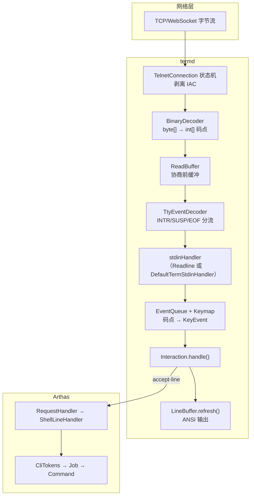

# inputrc 键盘绑定与控制台输入在 termd 中的流转

> 归档自问答：`com/taobao/arthas/core/shell/term/readline/inputrc` 是什么、控制台按什么会触发事件、输入字符串在 termd 里如何一层层流转；以及 `"\e[1~": beginning-of-line` 冒号左侧含义、是否区分 Win/Linux/Xshell。
>
> 归档日期：2026-06-17

关联文档：[readline-interaction-handle.md](./readline-interaction-handle.md)、[command-flow-and-termd.md](./command-flow-and-termd.md)、[telnet-negotiation-and-accept.md](./telnet-negotiation-and-accept.md)

关联项目：`D:\mycode\termd`

---

## 问题一：`inputrc` 是什么？控制台输入什么会触发？在 termd 里怎么流转？

### 1. `inputrc` 是什么？

路径：`core/src/main/resources/com/taobao/arthas/core/shell/term/readline/inputrc`

它是 **GNU Bash / Emacs readline 风格的键盘绑定表**，格式为：

```text
"按键序列": 函数名
```

启动时由 `Helper.loadKeymap()` 加载（优先级：`~/.arthas/conf/inputrc` → 本文件 → termd 默认 `inputrc`），`InputrcParser` 把 `"keyseq"` 解析成 `int[]` 码点序列，生成 `FunctionEvent`，放进 `Keymap.bindings`。

**它不处理普通可打印字符**（`a`、`1`、`-` 等）。那些字符不在表里，会作为「单字符 `KeyEvent`」直接插入行缓冲。

函数名必须对应已注册的 `io.termd.core.readline.Function`（termd 通过 `META-INF/services` SPI 加载，`TermImpl` 里 `readline.addFunction(...)` 注册）。**表里写了但 SPI 里没有的函数，按了只会打 warn，没有任何效果。**

### 2. `\C-` 写法对照（inputrc 语法）

| 写法 | 码点 | 你通常按的是 |
|------|------|--------------|
| `\C-a` … `\C-z` | 1 … 26 | Ctrl+A … Ctrl+Z |
| `\C-i` | 9 | **Tab** |
| `\C-j` | 10 | Enter（LF，少见） |
| `\C-m` | 13 | **Enter**（CR，常见） |
| `\C-h` | 8 | Backspace |
| `\C-?` | 127 | Delete / Backspace（视终端） |
| `\e` | 27 | ESC 前缀 |
| `\e[D/C/A/B` | 27,91,68/67/65/66 | **← → ↑ ↓**（常见 VT100） |
| `\e[3~` | 27,91,51,126 | **Delete**（xterm 等） |

### 3. Arthas `inputrc` 完整绑定表

#### 通用编辑（Emacs 风格）

| 你按的键 | inputrc 序列 | 函数名 | 实际效果 |
|----------|--------------|--------|----------|
| **Ctrl+A** | `\C-a` | `beginning-of-line` | 光标移到行首 |
| **Ctrl+E** | `\C-e` | `end-of-line` | 光标移到行尾 |
| **Ctrl+F** | `\C-f` | `forward-word` | 光标向前跳一个词 |
| **Ctrl+B** | `\C-b` | `backward-word` | 光标向后跳一个词 |
| **←** | `\e[D` | `backward-char` | 光标左移一格 |
| **→** | `\e[C` | `forward-char` | 光标右移一格 |
| **↑** | `\e[A` | `history-search-backward` | 按前缀向后搜历史（Arthas 定制，不是简单上一条） |
| **↓** | `\e[B` | `history-search-forward` | 按前缀向前搜历史 |
| **Backspace** | `\C-h` 或 `\C-?` | `backward-delete-char` | 删除光标前一个字符 |
| **Ctrl+U** | `\C-u` | `undo` | 撤销 |
| **Ctrl+D** | `\C-d` | `delete-char` | 删除光标处字符（行非空时） |
| **Ctrl+K** | `\C-k` | `kill-line` | 删除光标到行尾 |
| **Tab** | `\C-i` | `complete` | 命令/参数补全 |
| **Enter** | `\C-j` / `\C-m` | `accept-line` | 提交当前行 |
| **Ctrl+W** | `\C-w` | `backward-delete-word` | ⚠️ **未实现**（SPI 无此函数） |
| **Ctrl+X 再 Delete** | `\C-x\e[3~` | `backward-kill-line` | 向后删到行首 |
| **Alt+Backspace** | `\e\C-?` | `backward-kill-word` | 向后删一个词 |

#### 各终端兼容键（Home/End/Delete 等）

| 你按的键 | 序列 | 函数名 | 状态 |
|----------|------|--------|------|
| Home（Linux console） | `\e[1~` | `beginning-of-line` | ✅ |
| End | `\e[4~` | `end-of-line` | ✅ |
| Page Up | `\e[5~` | `beginning-of-history` | ⚠️ 未实现 |
| Page Down | `\e[6~` | `end-of-history` | ⚠️ 未实现 |
| Delete | `\e[3~` | `delete-char` | ✅ |
| Insert | `\e[2~` | `quoted-insert` | ⚠️ 未实现 |
| Home/End（rxvt） | `\e[7~` / `\e[8~` | 行首/行尾 | ✅ |
| Home/End（xterm） | `\eOH` / `\eOF` | 行首/行尾 | ✅ |
| Home/End（FreeBSD） | `\e[H` / `\e[F` | 行首/行尾 | ✅ |

### 4. 不在 `inputrc` 里、但 readline 仍特殊处理的键

这些在 `Interaction.handle()` 里硬编码，**不经过 inputrc**：

| 按键 | 行为 |
|------|------|
| **Ctrl+D**（空行） | EOF，`end(null)` → 断开/退出 |
| **Ctrl+C** | 清空当前行，换行，重打 prompt |
| **Ctrl+L** | 清屏并重画当前行 |

readline 活跃期间 `install()` 会把 `conn.setEventHandler(null)`，所以 Ctrl+C/D 由 readline 自己处理，不走 `TtyEventDecoder` → `EventHandler`。

### 5. 普通字符（例如输入 `dashboard`）

| 输入 | inputrc | 实际路径 |
|------|---------|----------|
| `d`、`a`、`s`、`h`、`b`、`o`、`a`、`r` 等可打印字符 | **无绑定** | `EventQueue` 无匹配 → 单字符 `KeyEvent` → `buffer.insert` → `refresh()` 画到屏幕 |
| 空格、`-`、`.` 等 | 同上 | 同上 |

### 6. 控制台输入在 termd 里怎么一层层流转？

以在 `[arthas@xxx]$` 提示符下敲 `dashboard` 并回车为例（Telnet/HTTP Telnet 路径相同，TTY 语义层一致）。

#### 6.1 总览



#### 6.2 逐层说明

**第 1 层：网络收字节**

```text
Netty channelRead(ByteBuf)
  → TelnetConnection.receive(byte[])   // 状态机，0xFF 开头走 IAC 协商
  → 纯用户数据进入 onData(byte[])
```

你敲的 `d` 在网络上是 UTF-8 的 `0x64` 一个字节（ASCII 情况）。

**第 2 层：`BinaryDecoder` — 字节 → Unicode 码点**

```text
byte[] → CharsetDecoder → int[] codePoints
```

契约：**termd TTY 层统一用 `int[]`，每个 int 是一个 Unicode 码点**，不是 `byte[]` 也不是 `char`。

`d` → `[100]`；中文等多字节字符会在这里解码成单个码点。

**第 3 层：`ReadBuffer` — Telnet 协商前暂存**

连接刚建立时要协商 ECHO/BINARY/NAWS；协商完成前数据先入队，完成后 `drain` 给下一层。

**第 4 层：`TtyEventDecoder` — 信号字符分流**

扫描 `int[]`，遇到：

| 码点 | 事件 |
|------|------|
| 3 | `TtyEvent.INTR`（Ctrl+C） |
| 26 | `TtyEvent.SUSP`（Ctrl+Z） |
| 4 | `TtyEvent.EOF`（Ctrl+D） |

**readline 活跃时** `eventHandler == null`，这些码点 **不再分流**，整批交给 stdinHandler。

普通字符 `d`(100) 直接 `readHandler.accept([100])`。

**第 5 层：Arthas `stdinHandler` — 两种模式**

| 状态 | handler | 行为 |
|------|---------|------|
| 空闲（未 `readline()`） | `DefaultTermStdinHandler` | `term.echo()` + `queueEvent()` |
| **`[arthas@xxx]$` 等待输入** | Readline `install()` 替换的 handler | `decoder.append(codePoints)` → `deliver()` |

日常敲命令走第二种：

```java
// Readline.Interaction.install()
conn.setStdinHandler(data -> {
    synchronized (Readline.this) { decoder.append(data); }
    deliver();
});
```

**第 6 层：`EventQueue` + `Keymap`（inputrc）— 码点 → 语义事件**

`pending` 缓冲里累积码点，`match()` 做 **最长前缀匹配**：

```text
敲 'd' → pending=[100] → 无 binding 匹配 → KeyEvent(单字符 100)
敲 Enter → pending=[13] → 匹配 "\C-m" → FunctionEvent("accept-line")
敲 Tab → pending=[9] → 匹配 "\C-i" → FunctionEvent("complete")
敲 ↑ → pending=[27,91,65] → 匹配 "\e[A" → FunctionEvent("history-search-backward")
敲 ESC 未完成 → pending=[27] → prefixes>0 → 暂不消费，等后续字节
```

**第 7 层：`Interaction.handle(KeyEvent)`**

```text
单字符 'd'  → buffer.insert('d') → refresh() → stdoutHandler 输出 ANSI
accept-line → ACCEPT_LINE → end("dashboard") 
Tab         → Complete → Arthas CompletionHandler → 补全后 resume()
```

屏幕上的字符是 `LineBuffer.update()` 的 ANSI diff，不是 `term.echo()`（见 [term-echo-and-readline.md](./term-echo-and-readline.md)）。

**第 8 层：回到 Arthas**

```text
end("dashboard")
  → RequestHandler.accept(line)
  → ShellLineHandler.handle("dashboard")
  → CliTokens.tokenize → Job → Command 执行
```

#### 6.3 一次完整输入的时间线

以输入 `ls` + Enter 为例：

```text
1. 网络: 'l'(0x6C) 's'(0x73) 可能分两次或一次到达
2. BinaryDecoder: [108]  [115]  （或合并 [108,115]）
3. TtyEventDecoder: 原样透传
4. Readline stdinHandler: decoder.append(...)
5. EventQueue: KeyEvent('l') → handle → buffer="l" → refresh
6. EventQueue: KeyEvent('s') → handle → buffer="ls" → refresh
7. Enter: FunctionEvent("accept-line") → ACCEPT_LINE → end("ls")
8. ShellLineHandler: 创建 Job 执行 ls 命令
```

#### 6.4 出站（你看到的输出）反向路径

```text
LineBuffer.refresh() / conn.write(prompt)
  → conn.stdoutHandler()  Consumer<int[]>
  → TtyOutputMode / BinaryEncoder
  → byte[]
  → TelnetConnection.write()
  → Netty → 客户端终端显示
```

### 7. 和 `inputrc` 相关的两个注意点

1. **终端差异**：同一个「Home」键，xterm 发 `\eOH`，Linux console 发 `\e[1~`。`inputrc` 里多套绑定就是为了兼容不同客户端。
2. **未实现函数**：`backward-delete-word`、`beginning-of-history`、`end-of-history`、`quoted-insert` 在 inputrc 里有，但 termd SPI 没注册，按了会在日志里出现 `Unimplemented function ...`，界面上无反应。

---

## 问题二：`"\e[1~": beginning-of-line` 左边是什么？怎么区分 Win/Linux/Xshell？

### 1. `"\e[1~"` 左边到底是什么？

这一行：

```text
"\e[1~": beginning-of-line
```

含义是：

> 当服务端收到的输入码点序列 **恰好是** `[27, 91, 49, 126]` 时，触发 `beginning-of-line`（光标移到行首）。

对应关系：

| 写法 | 码点 | 含义 |
|------|------|------|
| `\e` | 27 | ESC |
| `[` | 91 | 左方括号 |
| `1` | 49 | 字符 `1` |
| `~` | 126 | 波浪号 |

**你按 Home 时**：终端模拟器往 socket 里 **写** 这几个字节（常见是 `1B 5B 31 7E`），**屏幕上不会出现** `\e[1~` 这几个可见字符。

和「打印」的关系：

- **入站（你问的左边）**：键盘 → 终端发字节 → termd `BinaryDecoder` 解码 → `int[]` → `EventQueue` 和 inputrc 做匹配
- **出站（显示）**：`LineBuffer.refresh()` / `conn.write()` → 编码成字节 → 发到客户端 → 终端 **渲染** 到屏幕

所以左边是 **输入绑定**，不是输出内容。

### 2. 会不会区分 Win / Linux / Xshell？

**Arthas + termd 在选 keymap 时，不会根据你的操作系统或客户端类型做分支。**

`Helper.loadKeymap()` 在启动时加载 **同一份** `inputrc`（或 `~/.arthas/conf/inputrc`），所有连接共用：

```java
// Helper.loadKeymap()
return new Keymap(loadInputRcFile());
// 优先级：~/.arthas/conf/inputrc → arthas 内置 inputrc → termd 默认 inputrc
```

Telnet 虽然会协商 **TERMINAL_TYPE**（客户端可能上报 `xterm`、`VT100` 等），`TermImpl.type()` 也能读到，但 **加载 inputrc / 匹配按键时完全没用这个信息**。

策略是 **「广撒网」**：把各家常用的 Home 序列都写进同一张表，谁发哪种就匹配哪种：

```text
"\e[1~": beginning-of-line    # Linux console 等
"\eOH":  beginning-of-line    # xterm
"\e[H":  beginning-of-line    # 另一种 xterm/部分终端
"\e[7~": beginning-of-line    # rxvt
...
```

`EventQueue.match()` 做的是 **最长前缀匹配**：客户端实际发来什么序列，就命中哪一条；**不会先判断「你是 Windows 还是 Linux」**。

### 3. 编码解码是同一套规则吗？

要分两层：

#### 3.1 字符编码（文本）——基本同一套

termd 用 `BinaryDecoder` + 约定 charset（Telnet 里常见 UTF-8）：

```text
网络 byte[] → CharsetDecoder → int[] 码点
```

不管你是 Xshell、Windows Terminal、Linux `telnet`、macOS iTerm，**只要连的是同一套 Telnet/Web 终端协议，解码规则一样**：字节按 charset 变成 Unicode 码点。

普通字符 `d`、`中` 都走这条路。

#### 3.2 功能键序列（Home、方向键等）——各终端发的不一样

**物理键相同，不同终端模拟器发的字节序列可以不同**。例如 Home：

| 客户端/模式 | 常见发送序列（解码后码点） |
|-------------|---------------------------|
| Linux console | `\e[1~` → `[27,91,49,126]` |
| xterm / 很多 SSH 客户端 | `\eOH` 或 `\e[H` |
| rxvt | `\e[7~` |
| 老 Windows CMD | 可能根本没有标准 Home，或行为不同 |

所以：

- **编码规则**（UTF-8 等）是统一的；
- **「按 Home 发哪串字节」** 不统一，由 **终端模拟器** 决定，不是 OS 内核决定。

Arthas 用一份 inputrc 列出多种序列，等价于：**不探测客户端，靠匹配兜底**。

### 4. 以 Home 为例的完整路径

```text
你在 Xshell 里按 Home
  → Xshell 按自己的仿真类型（常选 xterm）发送 ESC 序列（可能是 \eOH，不是 \e[1~）
  → TCP 字节到达 Arthas
  → TelnetConnection 剥 IAC，留下纯数据
  → BinaryDecoder: byte[] → int[]  例如 [27, 79, 72]
  → TtyEventDecoder → Readline stdinHandler
  → EventQueue.match():
       若匹配 "\eOH" → FunctionEvent("beginning-of-line")
       若你终端发的是 \e[1~ → 匹配 inputrc 里那一行
       若发的序列表里都没有 → 可能把 ESC 当普通字符或等待后续字节，Home 无效
  → handle() → BeginningOfLine.apply() → 光标移到行首
```

若你的终端发的是 `\e[1~`，就会命中你问的那一行；若发的是 `\eOH`，会命中文件里另一行，**效果一样，绑定的键序列不同**。

### 5. 和「普通输入字符」的对比

| | 普通字符 `d` | 功能键 Home |
|--|-------------|-------------|
| inputrc | **无** 绑定 | 有多条绑定（兼容不同终端） |
| 匹配结果 | 单字符 `KeyEvent` | `FunctionEvent("beginning-of-line")` |
| 谁决定发什么 | 就是 `d` 的 UTF-8 字节 | **终端模拟器** 决定的 ESC 序列 |
| 是否区分 OS | 否 | 否（靠多绑几条，不靠检测 OS） |

### 6. 实际使用上的结论

1. **左边 = 输入码点序列**，不是屏幕显示内容。  
2. **不区分 Win/Linux/Xshell**；Xshell 在 Windows 上若仿真 xterm，往往发 xterm 序列，不是「Windows 专用一套」。  
3. **文本编码统一**（UTF-8 等）；**功能键序列不统一**，所以 inputrc 里同一功能写多行。  
4. 若某个键不灵，用终端「键盘/仿真类型」调成 xterm 类，或在 `~/.arthas/conf/inputrc` 里按你终端实际发的序列加绑定。

---

## 相关源码索引

| 主题 | 文件 |
|------|------|
| Arthas inputrc | `arthas/core/.../readline/inputrc` |
| keymap 加载 | `arthas/.../term/impl/Helper.java` |
| 事件匹配 | `termd/.../readline/EventQueue.java` |
| inputrc 解析 | `termd/.../readline/InputrcParser.java` |
| 按键处理 | `termd/.../readline/Readline.java`（`Interaction.handle`） |
| Function SPI | `termd/.../META-INF/services/io.termd.core.readline.Function` |
