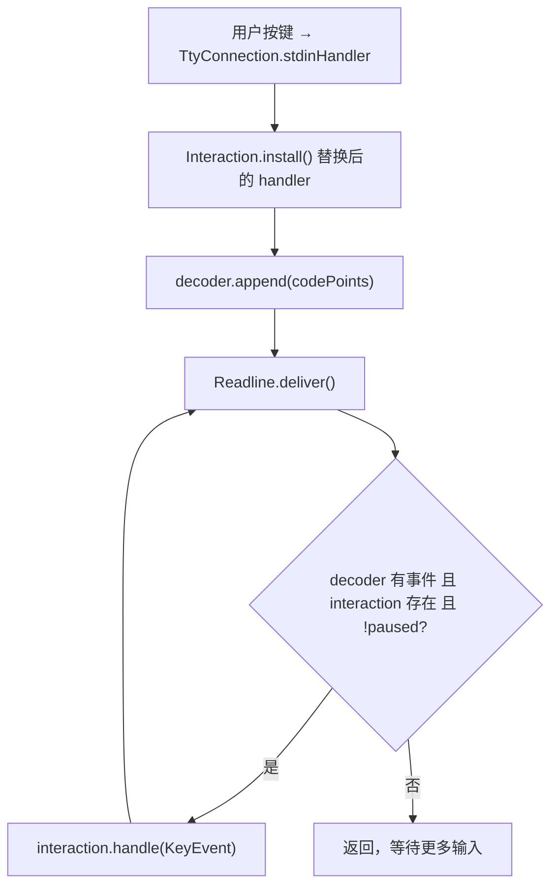
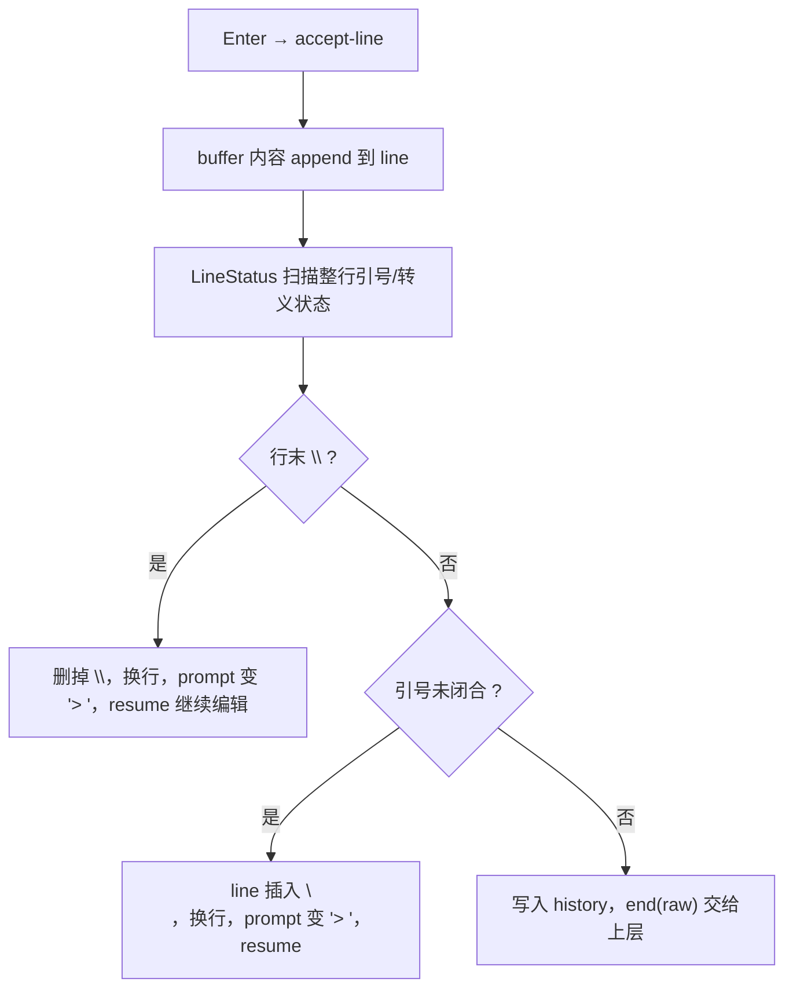
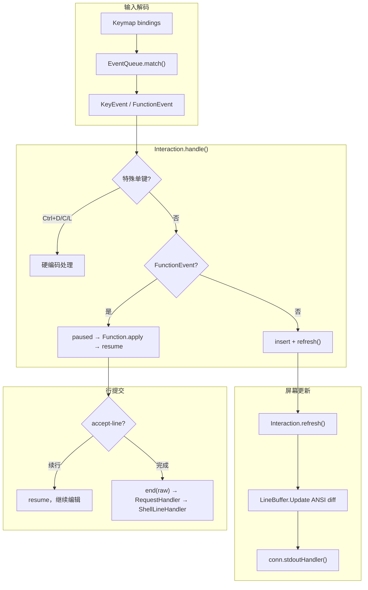

# Readline.Interaction#handle 深度解析

> 归档自问答：解释 `io.termd.core.readline.Readline.Interaction#handle` 的职责、调用链，以及 `refresh` / `ACCEPT_LINE` / `Keymap` 的协作关系。
>
> 归档日期：2026-06-17

关联文档：[command-flow-and-termd.md](./command-flow-and-termd.md)、[term-echo-and-readline.md](./term-echo-and-readline.md)

关联项目：`D:\mycode\termd`（Arthas 终端底层库）

---

## 1. 角色定位

`handle` 是 **一次 readline 交互期间的核心按键分发器**：把 `EventQueue` 解码出来的 `KeyEvent`，变成「结束输入 / 特殊控制键 / 绑定函数 / 普通字符插入」四种行为之一。

它不是入口方法。完整调用链：



对应源码（`termd/.../readline/Readline.java`）：

```java
private void deliver() {
    while (true) {
        Interaction handler;
        KeyEvent event;
        synchronized (this) {
            if (decoder.hasNext() && interaction != null && !interaction.paused) {
                event = decoder.next();
                handler = interaction;
            } else {
                return;
            }
        }
        handler.handle(event);
    }
}
```

要点：

- `deliver()` 会 **循环消费** 事件队列，一次 `handle` 可能连着处理多个键（例如粘贴多字符）。
- `paused == true` 时 `deliver()` 会停住，等 `Function` 做完后调用 `interaction.resume()` 再继续。

---

## 2. `KeyEvent` 从哪来

`EventQueue` 用 `Keymap` 做最长前缀匹配：

| 匹配结果 | 类型 | 例子 |
|---------|------|------|
| 命中 keymap 里某条绑定 | `FunctionEvent` | Enter → `accept-line`，Backspace → `backward-delete-char` |
| 没命中、且没有「更长前缀」在等待 | 匿名 `KeyEvent`（单字符） | 直接敲 `a`、`1` |
| 有更长前缀在等待 | 暂不产出事件 | 例如 ESC 后还要等后续字节 |

---

## 3. `handle` 方法本体（四段逻辑）

源码位置：`termd/src/main/java/io/termd/core/readline/Readline.java`（`Interaction` 内部类）

### 3.1 第一段：硬编码的特殊单键（不走 Function 体系）

只在 `event.length() == 1` 时检查三个控制字符：

| 码点 | 键 | 条件 | 行为 |
|------|-----|------|------|
| `4` | Ctrl+D | 当前行 `buffer` 为空 | `end(null)` → **EOF**，上层收到 `null` |
| `3` | Ctrl+C | 任意 | 清空 `line`/`buffer`/`data`/历史索引，换行，重打 prompt（相当于取消当前行） |
| `12` | Ctrl+L | 任意 | ANSI 清屏 `\033[H\033[2J`，再 `redraw()` 重画当前行 |

这些行为 **故意写死在 `handle` 里**（注释：`cannot be encapsulated in a function flow`）。

注意：Ctrl+C 在这里处理，是因为 `install()` 里把 `conn.setEventHandler(null)` 关掉了 Tty 层对 Ctrl+C 的默认分流，readline 期间自己管。

### 3.2 第二段：`FunctionEvent` → 调用注册的 `Function`

流程：

1. 从 `functions` 表（keymap + `addFunction` 注册的）查函数；
2. 找到则 **`paused = true`**，再 `function.apply(this)`；
3. 找不到只打 warn，**不会** `resume()`，事件算被丢弃。

`paused` 的意义：`Function.apply` 可能改 buffer、刷屏幕、查历史；做完必须 `resume()`，否则 `deliver()` 不再处理后续按键。

典型 `Function` 模式（以退格为例，`BackwardDeleteChar.java`）：

```java
public void apply(Readline.Interaction interaction) {
    LineBuffer buf = interaction.buffer().copy();
    buf.delete(-1);
    interaction.refresh(buf);
    interaction.resume();
}
```

Enter 对应内置的 `ACCEPT_LINE`：可能多行续行（`\` 转义、引号未闭合），最终 `end(raw)` 把整行字符串交给 `requestHandler`。

### 3.3 第三段：普通字符 → 插入 buffer + `refresh`

非 `FunctionEvent` 时：

1. `buffer.copy()` 得到副本；
2. 把 event 里每个码点 `insert` 进去；
3. 非法字符（`LineBuffer.insert` 抛异常）→ 终端响铃 `\007`；
4. `refresh(buf)` 用 **ANSI diff** 更新屏幕，并把 `buffer` 同步为新状态。

这是你在 `[arthas@xxx]$` 下敲字时 **屏幕上看到字符变化** 的主路径（不是 Arthas 的 `term.echo()`）。详见 [term-echo-and-readline.md](./term-echo-and-readline.md)。

---

## 4. `Interaction` 内部状态

| 字段 | 作用 |
|------|------|
| `buffer` | 当前正在编辑的这一「行片段」（多行命令时可能只有当前段） |
| `line` | 已确认的多行内容（`accept-line` 在续行时往这里拼） |
| `currentPrompt` | 当前行提示符（默认 `prompt`，续行时变成 `"> "`） |
| `historyIndex` | 历史浏览位置（上下翻历史用） |
| `data` | 给各 `Function` 挂临时数据的 Map |
| `paused` | 是否暂停 `deliver()` |
| `requestHandler` | 行提交后的回调（Arthas 里是 `RequestHandler`） |

`end(String s)` 会：恢复原来的 stdin/size/event handler → 清空 `Readline.interaction` → 调用 `requestHandler.accept(s)`。

Arthas 侧（`RequestHandler.java`）：

```java
public void accept(String line) {
    term.setInReadline(false);
    lineHandler.handle(line);
}
```

即：`handle` 里 `end(raw)` / `end(null)` 之后，才会进入 `ShellLineHandler` 做分词、执行命令。

---

## 5. 和 `install()` 的配合

`readline()` 启动时会 `install()`：

```java
private void install() {
    prevReadHandler = conn.getStdinHandler();
    conn.setStdinHandler(new Consumer<int[]>() {
        @Override
        public void accept(int[] data) {
            synchronized (Readline.this) {
                decoder.append(data);
            }
            deliver();
        }
    });
    conn.setEventHandler(null);
}
```

因此 **readline 活跃期间**：

- 输入不再走 `DefaultTermStdinHandler` 的 `echo + queueEvent`；
- 每个 `int[]` 批次直接进 `decoder`，立刻 `deliver()` → `handle()`。

---

## 6. Arthas 对 `Interaction` 的扩展

Arthas 用动态代理拦截 history 类 `Function`：未鉴权时 **不执行历史逻辑**，只 `interaction.resume()`，避免泄露历史命令（`FunctionInvocationHandler.java`）。

`Function` 若被拦截且不调用 `resume()`，readline 会 **永久卡住**（`paused` 一直为 true）。

---

## 7. `Interaction.refresh()` 与 `LineBuffer.update()` —— ANSI diff 绘制

### 7.1 两层封装

`handle()` 里普通字符插入后调用 `Interaction.refresh(buf)`，它做三件事：

1. 构造 **旧屏幕状态**：`currentPrompt` + 当前 `buffer`
2. 构造 **新屏幕状态**：`currentPrompt` + 更新后的 `update`
3. 调用 `LineBuffer.update(dst, out, width)` 做 diff，输出最小 ANSI 变更

```java
private void refresh(LineBuffer update, int width) {
    // copy3 = prompt + 旧 buffer（当前屏幕状态）
    // copy2 = prompt + 新 buffer（目标屏幕状态）
    copy3.update(copy2, collector, width);
    conn.stdoutHandler().accept(Helper.convert(codePoints));
    buffer.clear();
    buffer.insert(update.toArray());
    buffer.setCursor(update.getCursor());
}
```

### 7.2 `Update` 算法核心思路

`LineBuffer` 内部类 `Update` 维护四套坐标：

| 变量 | 含义 |
|------|------|
| `scrCol/scrRow` | 终端物理光标当前在哪 |
| `srcIdx/srcCol/srcRow` | 旧 buffer 扫描进度 |
| `dstIdx/dstCol/dstRow` | 新 buffer 扫描进度 |

主循环逻辑（简化）：

```text
对每个目标字符 dst[c]：
  若 src 与 dst 在同一屏幕位置且字符相同 → 跳过（零输出）
  若位置相同但字符不同     → moveCursor + 输出新字符
  若位置不同               → moveCursor + 输出新字符

换行处理：
  需要 glitch correction（行尾折行边界）→ 输出 " \r"
  目标比源多一行           → 补 \n
  源比目标长               → \033[K 擦到行尾

最后：
  moveCursor 到 dst 的逻辑光标位置
  把内部 data/cursor/size 同步为 dst
```

`moveCursor` 用的 ANSI：

| 动作 | 序列 |
|------|------|
| 回到行首 | `\r` |
| 右移一格 | `\033[1C` |
| 左移一格 | `\b` |
| 上移一行 | `\033[1A` |
| 下移一行 | `\033[1B` |
| 擦到行尾 | `\033[K` |

### 7.3 为何要考虑 `width`（终端宽度）

`LineBuffer` 用 `Wcwidth.of(cp)` 假定每个字符显示宽度为 1（暂不支持宽字符/组合字符）。当一行超过 `width` 时会 **自动折行**：

- `getCursorPosition(width)` / `getPosition(offset, width)` 把逻辑列号映射成 `(col, row)`
- diff 算法按 **屏幕行列** 比较，而不是按 buffer 下标

### 7.4 `redraw()` vs `refresh()`

| 方法 | 场景 | 策略 |
|------|------|------|
| `refresh(buf)` | 增量编辑（敲字、删字） | diff 旧→新，最小输出 |
| `redraw()` | 整行重画（Ctrl+L 清屏后） | 构造完整 `prompt+buffer`，调用 `update` 一次性刷新 |

---

## 8. `ACCEPT_LINE` —— Enter 提交与多行续行

Enter 在 keymap 里绑定为 `accept-line`（`\C-j` / `\C-m`，即 LF/CR）。`Readline` 构造时 `addFunction(ACCEPT_LINE)` 注册了这个内置函数。

### 8.1 提交流程



三种结局：

| 条件 | 行为 |
|------|------|
| `LineStatus.isEscaping()`（行末 `\`） | 删掉 `\`，换行，prompt 变 `"> "`，`resume` 继续编辑 |
| `LineStatus.isQuoted()`（引号未闭合） | `line` 插入 `\n`，换行，prompt 变 `"> "`，`resume` |
| 否则 | 写入 history，`end(raw)` 交给上层 |

### 8.2 `line` vs `buffer` 分工

| 缓冲区 | 作用 |
|--------|------|
| `buffer` | 当前正在编辑的「段」（单行片段） |
| `line` | 已确认的多行累积（续行时往这里拼） |

续行时只改 `currentPrompt` 为 `"> "`，最终 `end(raw)` 提交的是 `line.toString()`（含内部 `\n`）。

### 8.3 历史写入

`addToHistory` 在 `synchronized(Readline.class)` 里把新命令插到列表头部，上限 `MAX_HISTORY_SIZE = 500`，并做数组拷贝（防共享引用）。

---

## 9. `Keymap` —— 按键如何变成 `FunctionEvent`

### 9.1 加载链路（Arthas）

`Helper.loadKeymap()` 优先级：

1. `~/.arthas/conf/inputrc`（用户自定义）
2. Arthas 内置 `core/.../readline/inputrc`
3. termd 默认 `io/termd/core/readline/inputrc`

Arthas 内置 `inputrc` 相对 termd 默认的主要差异：

| 键 | termd 默认 | Arthas 默认 |
|----|-----------|-------------|
| ↑ | `previous-history` | `history-search-backward` |
| ↓ | `next-history` | `history-search-forward` |
| `\C-f/b` | — | `forward-word` / `backward-word` |
| `\C-w` | — | `backward-delete-word` |

### 9.2 `inputrc` 解析

`InputrcParser` 读每行 `"keyseq": function-name`，`parseKeySeq` 把字符串转成 `int[]`：

| 写法 | 码点 |
|------|------|
| `\C-i` | 9（Tab） |
| `\C-m` / `\C-j` | 13 / 10（Enter） |
| `\e[D` | `[27, '[', 'D']`（左箭头） |
| `\C-?` | 127（Delete） |

最终生成 `FunctionEvent(functionName, keySequence)` 放进 `Keymap.bindings`。

### 9.3 `EventQueue.match()` —— 最长前缀匹配

| 输入缓冲 | 结果 |
|----------|------|
| `[9]` | `FunctionEvent("complete")`（Tab） |
| `[13]` | `FunctionEvent("accept-line")`（Enter） |
| `[27]` | `null`（ESC 序列未完成，等待） |
| `[27,'[','A']` | `FunctionEvent("history-search-backward")`（Arthas ↑） |
| `[97]` | 匿名 `KeyEvent`，码点 `a` |

**最长匹配**保证 `\e[C`（右箭头）不会把 `\e` 单独当成字符。

### 9.4 Tab 补全完整链路

```text
用户按 Tab
  → stdinHandler: decoder.append([9])
  → deliver() → handle(FunctionEvent("complete"))
  → paused=true → Complete.apply(interaction)
  → completionHandler != null ?
       是：new Completion(interaction) → Arthas CompletionHandler
           → CliTokens.tokenize → CommandManagerCompletionHandler
           → completion.complete/suggest → interaction.refresh + resume
       否：直接 resume()
```

`Complete.apply` 本身很薄：有 `completionHandler` 就 `handler.accept(new Completion(interaction))`，否则直接 `resume()`。

`Completion.complete()` / `suggest()` 内部都会 `interaction.resume()`。

### 9.5 `Function` 注册

`Readline` 构造时 `addFunction(ACCEPT_LINE)`，Arthas `TermImpl` 还通过 SPI 加载更多 Function（`backward-delete-char`、`complete`、`history-search-*` 等）。

`handle()` 里 `functions.get(fname.name())` 查的就是这个表。

---

## 10. 三段逻辑串联总图

```text
handle(KeyEvent event)
│
├─ [单字符特殊键]
│   ├─ Ctrl+D + 空行 ──→ end(null)           // EOF
│   ├─ Ctrl+C ─────────→ 清空 + 换行 + 重打 prompt
│   └─ Ctrl+L ─────────→ 清屏 + redraw()
│
├─ [FunctionEvent]
│   ├─ 找到 Function ──→ paused=true → apply(this)
│   │                      └─ Function 内部 refresh/redraw/改 history...
│   │                      └─ 必须 resume() 才能继续收键
│   └─ 未实现 ──────────→ warn（事件丢失）
│
└─ [普通 KeyEvent]
    └─ copy buffer → insert 字符 → refresh() → 屏幕更新
```



---

## 11. 一句话总结

`Interaction#handle` 是 readline 的 **状态机核心**：

1. **先处理** 无法放进 Function 体系的 Ctrl+D/C/L；
2. **再区分** keymap 绑定的「编辑命令」和「裸字符输入」；
3. 编辑命令通过 **`paused` + `Function.apply` + `resume`** 保证一次只处理一个逻辑单元；
4. 裸字符通过 **`LineBuffer` + `refresh`** 做增量终端绘制；
5. 行结束由 `accept-line` 触发 `end()`，把 `String`（或 `null`）交给 Arthas 上层。

---

## 12. 相关源码索引

| 主题 | 文件 |
|------|------|
| `handle` / `refresh` / `ACCEPT_LINE` | `termd/.../readline/Readline.java` |
| ANSI diff | `termd/.../readline/LineBuffer.java` |
| 事件匹配 | `termd/.../readline/EventQueue.java` |
| keymap 配置 | `arthas/core/.../readline/inputrc` |
| keymap 加载 | `arthas/.../term/impl/Helper.java` |
| Tab 补全 | `termd/.../functions/Complete.java` + `arthas/.../CompletionHandler.java` |
| 引号状态机 | `termd/.../readline/LineStatus.java` |
| history 鉴权 | `arthas/.../FunctionInvocationHandler.java` |
| 行提交回调 | `arthas/.../handlers/term/RequestHandler.java` |
| echo 与 readline 分工 | [term-echo-and-readline.md](./term-echo-and-readline.md) |
