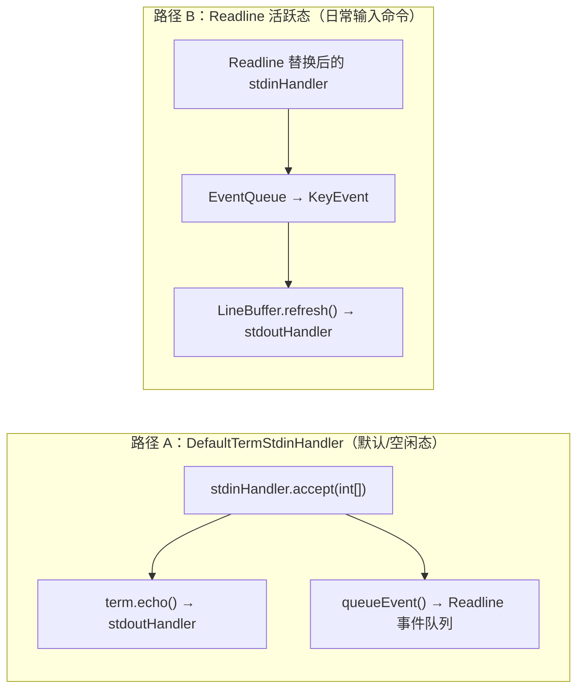

# termd / Arthas 中的「回显（echo）」机制

> 归档自问答：解释 `DefaultTermStdinHandler` 中 `term.echo()` 的含义，以及它与 Readline 行编辑的关系。

关联文档：[command-flow-and-termd.md](./command-flow-and-termd.md)、[readline-interaction-handle.md](./readline-interaction-handle.md)

---

## 1. 「回显」是什么意思？

**是的。** 从概念上讲，「回显（echo）」就是你敲一个字符，终端上立刻显示出你刚输入的那个字符。

对应代码：

```java
// com.taobao.arthas.core.shell.handlers.term.DefaultTermStdinHandler
public void accept(int[] codePoints) {
    term.echo(codePoints);                        // ① 回显到终端
    term.getReadline().queueEvent(codePoints);    // ② 送入 readline 事件队列
}
```

- **① `term.echo`**：让用户「看见」自己敲了什么
- **② `queueEvent`**：把同一批码点交给 Readline 做行编辑（进 buffer、处理退格、Enter 提交等）

设计上这是「**先显示，再交给 Readline 处理**」。

---

## 2. `term.echo(codePoints)` 具体做什么？

```java
// com.taobao.arthas.core.shell.term.impl.TermImpl
public void echo(int... codePoints) {
    Consumer<int[]> out = conn.stdoutHandler();
    for (int codePoint : codePoints) {
        if (codePoint < 32) {
            if (codePoint == '\t') {
                out.accept(new int[]{'\t'});
            } else if (codePoint == '\b') {
                out.accept(new int[]{'\b', ' ', '\b'});
            } else if (codePoint == '\r' || codePoint == '\n') {
                out.accept(new int[]{'\n'});
            } else {
                out.accept(new int[]{'^', codePoint + 64});  // 如 Ctrl+C → ^C
            }
        } else {
            if (codePoint == 127) {
                out.accept(new int[]{'\b', ' ', '\b'});
            } else {
                out.accept(new int[]{codePoint});  // 普通可打印字符
            }
        }
    }
}
```

它把码点写到 `conn.stdoutHandler()`，经 termd 编码后发回客户端，最终在屏幕上显示：

| 输入 | 屏幕表现 |
|------|----------|
| 普通可打印字符（如 `a`） | 直接显示 `a` |
| Backspace / Delete | 发送 `\b \b`，视觉上擦掉一个字符 |
| Tab | 显示制表符 |
| 其他控制字符 | 显示 `^C` 这种形式 |

**`echo` = 把输入「原样（或按规则处理后）写回终端输出流」**，不是做命令解析。

---

## 3. 关键细节：正常敲命令时，这段代码往往不会执行

Arthas 进入 `readline()` 等待输入时，Readline 会**替换**掉 `stdinHandler`：

```java
// io.termd.core.readline.Readline.Interaction
private void install() {
    prevReadHandler = conn.getStdinHandler();   // 保存 DefaultTermStdinHandler
    conn.setStdinHandler(new Consumer<int[]>() {
        @Override
        public void accept(int[] data) {
            synchronized (Readline.this) {
                decoder.append(data);   // 直接进 Readline，不经过 echo
            }
            deliver();
        }
    });
    conn.setEventHandler(null);  // readline 期间自己处理 Ctrl+C
}
```

因此在 `[arthas@xxx]$` 提示符下敲 `dashboard` 时，实际路径是：

```
按键 → Readline 自己的 stdinHandler
     → EventQueue → KeyEvent
     → LineBuffer.refresh()
     → conn.stdoutHandler() 输出（含 ANSI 光标控制）
     → 你在屏幕上看到字符
```

**显示字符的是 Readline 的 `refresh()`，不是 `DefaultTermStdinHandler` 里的 `term.echo()`。**

Readline 结束（按 Enter）后会恢复原来的 handler：

```java
// io.termd.core.readline.Readline.Interaction.end()
conn.setStdinHandler(prevReadHandler);  // 恢复 DefaultTermStdinHandler
```

---

## 4. `DefaultTermStdinHandler` 什么时候会用到？

| 场景 | 是否走 `DefaultTermStdinHandler` |
|------|----------------------------------|
| 在提示符下正常输入命令 | **否**（Readline 接管 stdin） |
| 连接刚建立、还没 `readline()` | 是 |
| `readline()` 结束到下一次 `readline()` 之间的空档 | 是 |
| 命令设置了 `process.stdinHandler(...)`（如 dashboard 按 `q` 退出） | **否**（换成 `StdinHandlerWrapper`） |

交互式命令（如 `dashboard`、`tt`）会通过 `process.stdinHandler(new QExitHandler(process))` 替换 stdinHandler，此时输入由命令自己的 handler 处理，也不走 `DefaultTermStdinHandler`。

---

## 5. 两种「显示输入」的路径对比



| | 路径 A | 路径 B |
|---|--------|--------|
| 触发时机 | 非 readline 活跃态 | `readline()` 等待输入期间 |
| 谁负责显示 | `term.echo()` | `LineBuffer.refresh()` + ANSI |
| 谁负责行编辑 | `queueEvent()` 间接参与 | Readline 直接处理 |

---

## 6. 一句话总结

- **「回显」** = 输入的字符发回终端显示，让你看到自己敲了什么。
- **`term.echo(codePoints)`** 就是这个作用：把码点写到 stdout，最终显示在控制台。
- **但在 Arthas 日常输入命令时**，你看到的字符主要是 **Readline 自己通过 `refresh()` 画出来的**，不是 `DefaultTermStdinHandler.accept()` 里那句 `term.echo()`。

`DefaultTermStdinHandler` 更像是 **termd 的默认 stdin 处理器模板**：「回显 + 喂给 Readline」。真正交互式行编辑时，Readline 会接管 stdin，自己负责显示和编辑逻辑。

---

## 7. 相关源码

| 文件 | 职责 |
|------|------|
| `core/.../handlers/term/DefaultTermStdinHandler.java` | 默认 stdin：echo + queueEvent |
| `core/.../shell/term/impl/TermImpl.java` | `echo()` 实现、readline 生命周期 |
| `termd/.../readline/Readline.java` | `install()` 替换 handler、`refresh()` 显示 |
| `termd/.../readline/LineBuffer.java` | 行缓冲与 ANSI diff 输出 |
